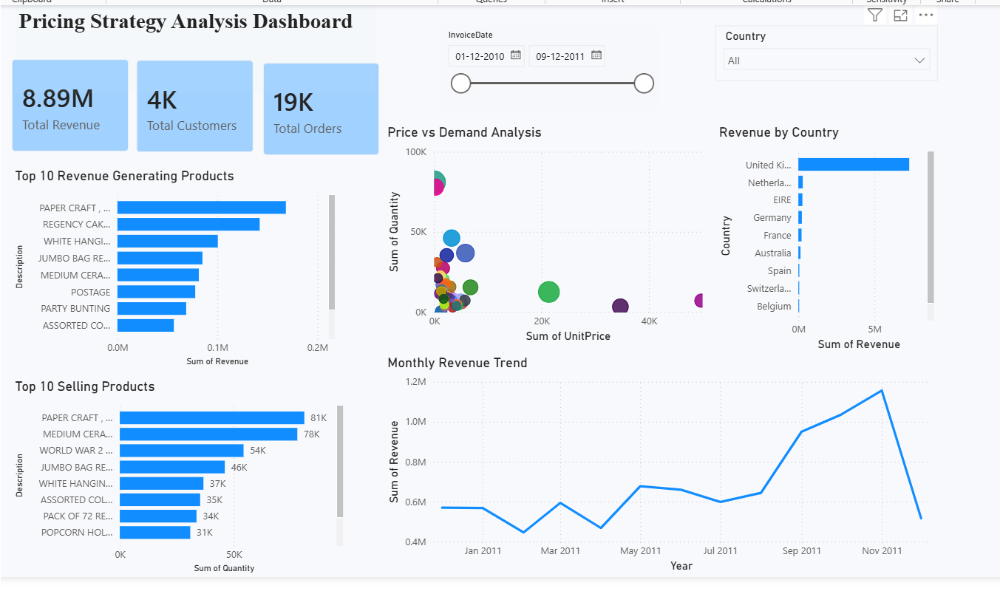

# Pricing Strategy Analysis and Revenue Optimization Using Retail Transaction Data

## Project Overview

This project analyzes retail transaction data to identify revenue drivers, customer purchasing behavior, pricing trends, and opportunities for revenue optimization.

The analysis was performed using Python, Pandas, NumPy, and Matplotlib.

---

## Dataset

* Dataset: Online Retail Dataset
* Records Analyzed: 397,884+
* Features: Invoice Details, Product Information, Quantity, Unit Price, Customer ID, Country

---

## Objectives

* Analyze sales and revenue performance
* Identify top revenue-generating products
* Study customer purchasing behavior
* Perform country-wise revenue analysis
* Analyze the relationship between price and demand
* Simulate discount strategies
* Generate business recommendations

---

## Tools Used

* Python
* Pandas
* NumPy
* Matplotlib
* Jupyter Notebook

---

## Key Findings

### Top Revenue Products

The highest revenue-generating products include:

* PAPER CRAFT, LITTLE BIRDIE
* REGENCY CAKESTAND 3 TIER
* WHITE HANGING HEART T-LIGHT HOLDER

### Country Analysis

The United Kingdom contributed the majority of total revenue, significantly outperforming all other countries.

### Monthly Revenue Trends

Revenue peaked during November 2011 with sales exceeding 1.15 million, indicating strong seasonal demand.

### Price vs Demand Analysis

A weak negative correlation (-0.0386) was observed between product price and quantity sold.

### Discount Simulation

Revenue increased under all simulated discount scenarios, suggesting that moderate discounts may improve overall revenue.

### Customer Analysis

A small group of high-value customers contributed a significant portion of total revenue.

---

## Business Recommendations

1. Focus marketing efforts on high-revenue products.
2. Prioritize the United Kingdom market.
3. Monitor premium-priced products for pricing optimization.
4. Introduce seasonal promotional campaigns.
5. Build loyalty programs for high-value customers.

---
## Dashboard Preview

---

## Project Structure

Pricing-Strategy-Analysis

├── README.md
├── requirements.txt
├── pricing_strategy_analysis.ipynb
├── Pricing_Strategy_Dashboard.pbix
├── Online_Retail_Cleaned.xlsx
├── dashboard.png
├── top_revenue_products.png
├── country_revenue.png
├── monthly_revenue.png
├── price_vs_demand.png
└── discount_impact.png

---

## Future Improvements

* Real competitor pricing data
* Machine learning demand forecasting
* Interactive Power BI dashboard
* Customer segmentation analysis

---

## Author

Ayushi joshi
